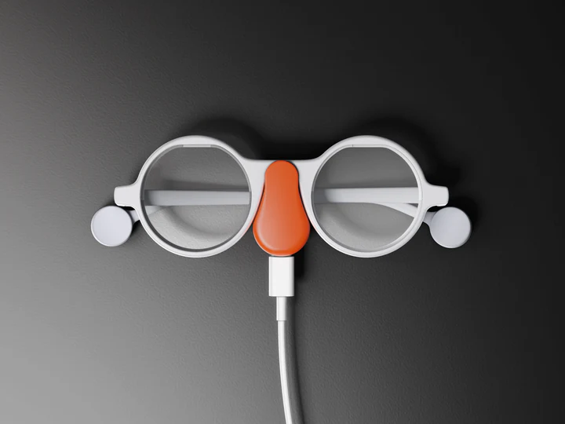

# ◉–◉ FrameVision: Smart Image Capture & Description with Location  

*Capture moments, extract locations, and caption images using Brilliant Labs Frame and LLaVA AI.*  

---

## 📝 Overview  

**FrameVision** seamlessly integrates the **Brilliant Labs Frame** smart glasses with the **LLaVA Vision-Language model** to:  
1. Capture photos.  
2. Extract and display the user's approximate **geolocation** using IP-based location services.  
3. Send the captured image to the **LLaVA model** running locally via **Ollama** to generate a textual description.  
4. Append the image description with a timestamp to `captions.txt`.  

This project is ideal for developers looking to experiment with AR hardware, AI-powered vision, and geospatial technologies.

---
 


---

## ✨ Features  

- **Smart Image Capture**: Uses Brilliant Labs Frame to take high-quality photos with camera autofocus.  
- **Location Extraction**: Automatically detects and displays the user’s approximate location (latitude, longitude, city, and country) using IP-based services.  
- **AI-Powered Descriptions**: Integrates the LLaVA model via **Ollama** to describe the content of captured images.  
- **Text Storage**: Appends generated image descriptions with timestamps to `captions.txt`.  
- **Error Handling & Debugging**: Ensures robust communication with LLaVA API and handles failures gracefully.  

---

## 🚀 Getting Started  

### Prerequisites  

- **Hardware**: Brilliant Labs Frame  
- **Software**:  
   - Python 3.7 or higher  
   - Frame SDK  
   - LLaVA model (via **Ollama**)  

---

### Step 1: Install Ollama  

[Ollama](https://ollama.ai/) is a tool to run large language and vision models locally on your machine. Follow these steps:

1. **Download and Install Ollama**:  
   - Visit [https://ollama.ai/download](https://ollama.ai/download).  
   - Follow the installation instructions for your operating system.

2. **Verify Installation**:  
   Run the following command in your terminal to ensure Ollama is installed:  
   ```bash
   ollama --version
   ```

---

### Step 2: Install the LLaVA Model  

LLaVA is a language and vision model capable of analyzing images and generating descriptions.

1. **Pull the LLaVA Model**:  
   Use the following command to download the LLaVA model:  
   ```bash
   ollama pull llava
   ```

2. **Run the LLaVA Model**:  
   Start the Ollama API server locally:  
   ```bash
   ollama serve
   ```

   > **Note**: Keep this terminal open while running the main script in other terminal.  

---

### Step 3: Install Python Dependencies  

1. Clone the repository:  
2. Install required libraries:  
   ```bash
   pip install frame-sdk requests
   ```
   ```bash
   pip install geopy
   ```

---

### Step 4: Run the Script  

Execute the script to capture images and generate descriptions:  
```bash
python testframe.py
```

---

## 📱 Usage  

1. **Connect the Frame**  
   - Pair the Brilliant Labs Frame with your computer via Bluetooth.  (the code will connect the bluetooth automatically, Just watch out for a popup asking you to connect the bluetooth once you run the code)

2. **Run the LLaVA Model**  
   - Start the LLaVA server using `ollama serve`.  

3. **Run the Script**  
   - The script captures an image using the Frame and sends it to the LLaVA model for analysis.  
   - It extracts your location and saves the image description to `captions.txt`.  

4. **View Results**  
   - Captured images are saved as `captured_photo.jpg`.  
   - Descriptions are logged in `captions.txt` with timestamps.  

---

## 🛠️ Built With  

- **[Brilliant Labs Frame SDK](https://pypi.org/project/frame-sdk/)**: Interacts with the Frame hardware for image capture.  
- **[LLaVA Model](https://github.com/haotian-liu/LLaVA)**: Generates image descriptions.  
- **[Ollama](https://ollama.ai/)**: Runs LLaVA locally with ease.  
- **[Requests](https://docs.python-requests.org/en/latest/)**: Handles API communication.  
- **[IP Geolocation (ipinfo.io)](https://ipinfo.io/)**: Provides approximate latitude, longitude, and location details.  

---

## 🧭 Example Output  

**Terminal Output**:  

```text
Requesting location permissions...  
Detected IP: 203.0.113.5  
Approximate location: Latitude 37.7749, Longitude -122.4194  
City: San Francisco, Region: California, Country: USA  

Captured photo size: 1.2 MB  
Photo saved as 'captured_photo.jpg'.  

LLaVA Response: "A person sitting on a beach looking at the sunset with waves crashing."  
```

**captions.txt**:  

```text
2024-06-17 14:30:01: A person sitting on a beach looking at the sunset with waves crashing.  
2024-06-17 14:50:32: A dog playing with a ball on a green grass field.  
```

---

## 📍 Location Extraction  

The script uses the IP-based geolocation service [ipinfo.io](https://ipinfo.io/) to extract:  
- Latitude and Longitude  
- City and Region  
- Country  

This feature allows you to log where each image was captured, adding spatial context to your photos.  

---

## Troubleshooting  

- **Bluetooth Connection**: Ensure the Frame is connected and paired correctly. (this is automated) 
- **LLaVA API Issues**: Confirm that the Ollama server is running. 
- **Ollama Not Running**: Verify that Ollama is installed and the model is running.  
- **Location Errors**: Ensure you have an active internet connection for IP geolocation.  

---

## 📄 License  

This project is licensed under the MIT License.

---

## 🙏 Acknowledgments  

- **[Brilliant Labs](https://brilliant.xyz/)** for their innovative Frame smart glasses.  
- **LLaVA Model Team** for the powerful vision-language API.  
- **[Ollama](https://ollama.ai/)** for simplifying local model deployment.  
- **[OpenCage](https://opencagedata.com/)** for providing geolocation services.  
- **Python Community** for libraries like `requests` and `unittest`.  
